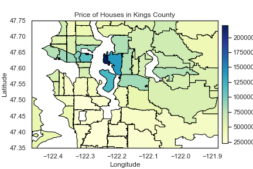
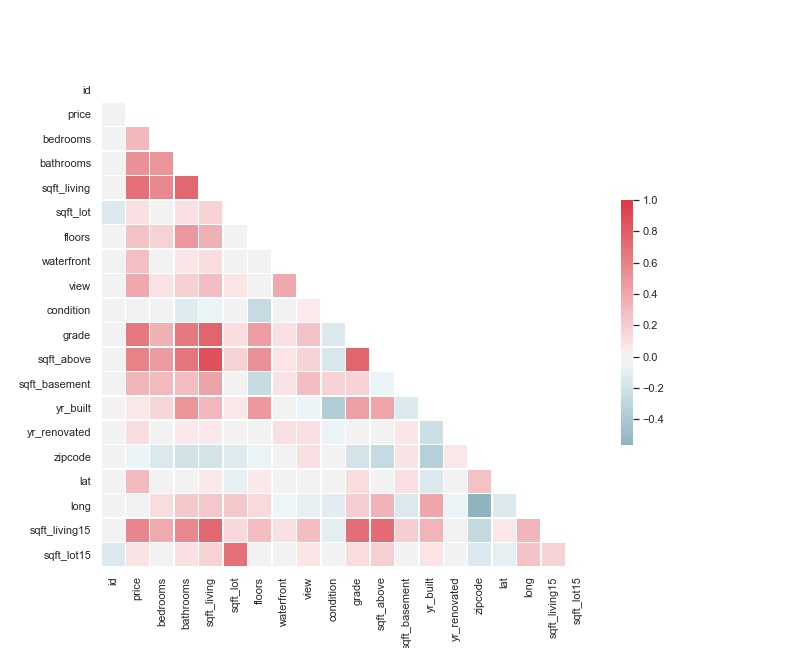

<p>

</p>


# Kings County Housing Prices Prediction

**Authors**: Ning Chen

This project created a model that can predict the prices of homes sold in the Seattle, WA area. All kinds of features related to the houses are provided. Linear and non-linear machine learning methods in scikit-learn library are used to construct the models with selected data. Housing prices are predicted within a reasonable error range.

## Business Understanding

A real estate agency in Seattle WA wants to predict the housing prices in order to develop market strategies and target potential customers. The prices of houses with various features are provided for year 2014-2015. Geographical data can also be fetched to enrich the pool of features. The study of population structure of residents is also an important factor for the prediction, but it is outside the scope of this project.  

## Data Understanding


### Exploratory Data Analysis (EDA)


### Heatmap




### Statistical Test


* Two-Sample T-test & Welch’s T-test

H0: The sample mean of prices of the houses with a view to a waterfront or not are the same. \
Ha: The sample mean of prices of the houses with a view to a waterfront or not are different.

* Chi-square Test

H0: Different conditions of the houses has been viewed the same time. \
Ha: Different conditions of the houses has been viewed different time.


* ANOVA and post hoc analysis (Tukey HSD Test)

H0: The sample mean of prices of the houses with different grading are the same. \
Ha: The sample mean of prices of the houses with different grading are different.


## Data Preparation

### Data Cleaning & Feature Engineering


The rows with extreme values is considered. Identify categorical variables in the data set and create dummy columns to numeric format through one-hot encoding. New features are generated.

### Interaction Features
Interaction in a non-additive manner when affecting a third variable.

### Multicollinearity

Calculation of correlation and VIF.




## Modeling

### Data Split and Normalization
Data is split to training and testing data, and then standardized with respect to normal distribution.

### Linear Regression


Fit the model to the training data. Use the model to predict on the training set and the test set. Evaluate the training and test predictions using RMSE. Determine if the model is overfit.

### Non-linear transformations
Polynomial features are implemented to investigate the effect of the non-linear terms.

### Feature Selection Techniques
KBest \
Forward Selection \
RFECV

### Lasso and Ridge
Except ordinary least squares, gradient descent algorithms are also tested.

## Evaluation
The housing prices is predicted for Kings County in Seattle WA. The model solve the problems for pridiction satisfactorily. New features are created to understand the questions. In any of these cases, it is also totally encouraged to revisit the earlier steps to optimze the features and model techniques.

## For More Information

Please review the full analysis in [our Jupyter Notebook](https://github.com/ghcn345/house-price-pridiction-with-statistical-test/blob/master/Housing%20Prices%20Prediction.ipynb) or the [presentation](https://github.com/ghcn345/house-price-pridiction-with-statistical-test/blob/master/CRISP-DM_Housing%20Prices%20Prediction.pdf).

For any additional questions, please contact **Ning Chen—chen.ning345@gmail.com**

## Repository Structure

Description of the structure of the repository and its contents:

```
├── README.md                                     <- The top-level README for reviewers of this project
├── Housing Prices Prediction.ipynb               <- Narrative documentation for prediction in Jupyter notebook
├── holdout_features.ipynb                        <- Narrative documentation for holdout in Jupyter notebook
├── CRISP-DM_Housing Prices Prediction.pdf        <- PDF version of project presentation
├── Data                                          <- Both sourced externally and generated from code
└── Images                                        <- Both sourced externally and generated from code

```


## Annotation

Column Names and descriptions for Kings County Data Set

* **id** - unique ID for a house
* **date** - Date day house was sold
* **price** - Price is prediction target
* **bedrooms** - Number of bedrooms
* **bathrooms** - Number of bathrooms
* **sqft_living** - square footage of the home
* **sqft_lot** - square footage of the lot
* **floors** - Total floors (levels) in house
* **waterfront** - Whether house has a view to a waterfront
* **view** - Number of times house has been viewed
* **condition** - How good the condition is (overall)
* **grade** - overall grade given to the housing unit, based on King County grading system
* **sqft_above** - square footage of house (apart from basement)
* **sqft_basement** - square footage of the basement
* **yr_built** - Year when house was built
* **yr_renovated** - Year when house was renovated
* **zipcode** - zip code in which house is located
* **lat** - Latitude coordinate
* **long** - Longitude coordinate
* **sqft_living15** - The square footage of interior housing living space for the nearest 15 neighbors
* **sqft_lot15** - The square footage of the land lots of the nearest 15 neighbors
